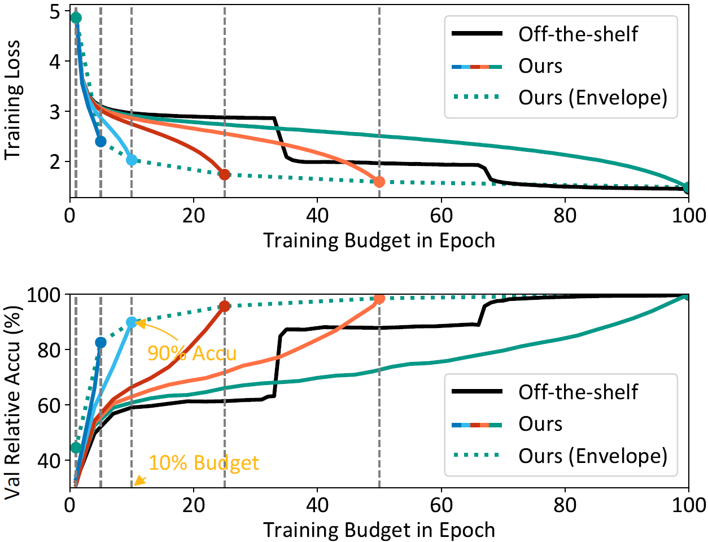
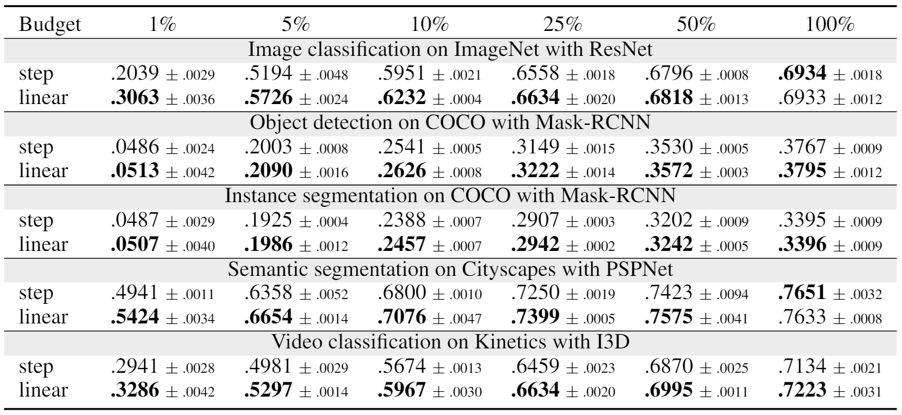

# LinearLR
This repository implements a tuning-free learning rate schedule for training deep neural networks and it is studied in [*Budgeted Training: Rethinking Deep Neural Network Training Under Resource Constraints*](https://arxiv.org/abs/1905.04753). This linearly decaying schedule outperforms the popular step decay on many benchmark tasks and is very useful in a low-budget setting (e.g. a small number of epochs).

<p align="center">
    
</p>

<p align="center">
    
</p>

[**[Paper]**](https://arxiv.org/abs/1905.04753)[**[Project Page]**](http://www.cs.cmu.edu/~mengtial/proj/budgetnn/)

## Installation
```
pip install linearlr
```
[](https://badge.fury.io/py/linearlr)

## Usage
```python
from linearlr import LinearLR

schedule = LinearLR(optimizer, T)
```
- optimizer: the PyTorch optimizers (e.g. SGD)
- T: the total number of iterations or epochs (you need to call `.step()` function accordingly after each iteration or epoch)

**How to determine the training iterations or epochs?**

As shown in the figure and table above, usually the more training budget the better the performance, but it is of diminishing returns. Attempting to find the exact budget where the diminishing return vanishes might be costly and not of much value. Therefore, it is recommended to determine the training iterations based on your training budget, i.e., how long you can afford to train given your model, dataset and resource available. Furthermore, it is shown in Appendix A of our [paper](https://arxiv.org/abs/1905.04753) that even training with a small budget, one can predict which model is better given full training budget.

As a side note, while our analysis mainly focuses on the linear schedule, preliminary experiments suggest that the family of smooth-decaying budget-aware schedules (such as cosine annealing) might deliver similar performance.

## Citation
If you find the code or our analysis useful for your research, please consider citing the paper:

```
@article{Li2020BudgetTrain,
  title={Budgeted Training: Rethinking Deep Neural Network Training Under Resource Constraints},
  author={Li, Mengtian and Yumer, Ersin and Ramanan, Deva},
  journal={ICLR},
  year={2020}
}
```
